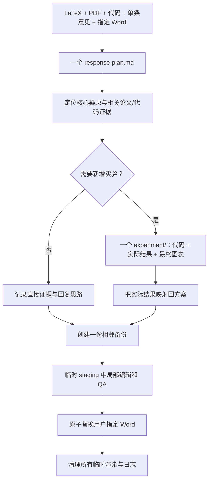

<div align="center">

# IEEE Transactions Review Response Engineer

### 把一条审稿意见，变成一条精简、可复现、可直接提交的证据链

[](./SKILL.md)
[](https://www.ieee.org/)
[](./SKILL.md)
[](./references/experiment-and-evidence-protocol.md)

**一次只处理一条意见 · 先完成实验再写回复 · 只保留三类核心产物 · 直接更新指定 Word**

</div>

---

## 它解决什么问题

`IEEE Transactions Review Response Engineer` 面向需要联合论文、代码和补充实验完成返修的场景。它不只是润色文字，而是判断审稿人的真实疑虑、确定足够的证据、完整执行必要实验，再把实际结果写成可核验的 `Author Response`。

新版工作流保留原有严谨性，同时取消机械化的目录、重复摘要、独立证据账本、delivery 副本和长期保存的 QA 缓存。

> **一个方案文件，一个按需实验目录，一个持续更新的 response Word。**

## 三类核心产物

```text
R2-C4/
├── response-plan.md            # 意见理解、论文/代码证据、回复思路、实验设计和实际结果
└── experiment/                 # 只有需要新增实验时才创建
    ├── run_*.py
    ├── config.*                # 仅在复现或原框架需要时保留
    ├── results.json/csv
    ├── table.*
    └── figure.pdf/png

response_to_reviewers.docx      # 用户指定的原文件，最终直接更新
response_to_reviewers.before-R2-C4.docx  # 修改前唯一备份
```

默认不再创建：

- `case.json`、`inputs/` 和通用 `notes/`；
- 独立的论文摘要、代码地图、case summary、evidence summary 和 evidence ledger；
- `response/` 中重复的 Markdown Author Response；
- `delivery/` 中的 Word 副本和预览 PDF；
- 多轮全页 PNG、结构差异 JSON、成功日志和 `__pycache__`；
- 机械化的 `raw/processed/logs/configs/src/figures` 六层目录。

## 精简后的工作流



## 严谨性没有降低

- 同时检查 LaTeX、最终 PDF 和实际代码；
- 每次只处理一条意见；
- 只复用条件完全匹配且来源可核验的既往证据；
- 不缩减数据、epoch、模型规模、基线、种子或搜索空间；
- 先写结论判定规则，再查看实验结果；
- 所有数值来自机器可读实际结果；
- 负面或混合结果必须如实呈现并收缩论文主张；
- Word 非目标区域必须保持不变，最终仍执行结构和视觉 QA。

被删除的是重复记录和永久缓存，不是必要实验或质量检查。

## 安装

### Windows PowerShell

```powershell
git clone https://github.com/whiteMo0623/ieee-transactions-review-response-engineer.git `
  "$env:USERPROFILE\.codex\skills\ieee-transactions-review-response-engineer"
```

### macOS / Linux

```bash
git clone https://github.com/whiteMo0623/ieee-transactions-review-response-engineer.git \
  "${CODEX_HOME:-$HOME/.codex}/skills/ieee-transactions-review-response-engineer"
```

调用名称：

```text
$ieee-transactions-review-response-engineer
```

## 快速开始

```text
$ieee-transactions-review-response-engineer

请处理 Reviewer 2 的 Comment 4。论文 LaTeX、PDF、实现代码、既往案件和
response_to_reviewers.docx 已放在项目目录中。案件目录只保留一个回复思路与
实验设计文件，以及必要的实验代码、实际结果和最终图表。请直接更新我指定的
response Word；修改前在同目录创建一份备份，不要在案件目录复制 Word、预览
PDF、渲染页、日志或重复摘要。
```

## 初始化最小案件

```bash
python scripts/init_review_case.py R2-C4 \
  --root response_exp \
  --paper-tex path/to/main.tex \
  --paper-pdf path/to/paper.pdf \
  --code-root path/to/repository \
  --comment-file path/to/comment.md \
  --word-file path/to/response_to_reviewers.docx \
  --previous-cases path/to/response_exp
```

初始化只创建 `R2-C4/response-plan.md`。它不会复制输入、扫描整个代码树、递归哈希既往案件或预先创建实验/QA/交付目录。

## response-plan.md 包含什么

所有必要推理集中在一个文件：

1. 原始意见；
2. 核心疑虑、证据缺口与审稿人预期；
3. 相关论文位置、代码文件/行号、配置和现有结果；
4. 与既往意见的关系及复用判定；
5. 回复思路和完整实验设计；
6. 实际结果、来源字段和结论边界；
7. Word 目标块、备份路径和验证结论。

## Word 原位更新

假设用户指定：

```text
response_exp/response_to_reviewers.docx
```

处理 `R2-C4` 时，Skill 只额外保留：

```text
response_exp/response_to_reviewers.before-R2-C4.docx
```

编辑在临时 staging 文件中完成。结构比较和最终渲染通过后，staging 原子替换用户指定 Word；案件目录不会出现第二份 Word。渲染页、临时 PDF、结构报告和编辑脚本在成功后删除。

## 一次性验收

```bash
python scripts/audit_review_case.py path/to/R2-C4
```

轻量审计检查：

- `response-plan.md` 已完成且无占位符；
- `experiment_required` 已明确为 `true` 或 `false`；
- 需要实验时存在运行代码和机器可读结果；
- 案件目录中没有 Word 副本、QA 渲染页、默认冗余目录或 Python 缓存；
- 指定 Word 与相邻的修改前备份均存在且内容不同。

## 仓库结构

```text
.
├── README.md
├── SKILL.md
├── agents/
│   └── openai.yaml
├── references/
│   ├── experiment-and-evidence-protocol.md
│   └── response-and-artifact-protocol.md
└── scripts/
    ├── init_review_case.py
    └── audit_review_case.py
```

---

<div align="center">

**减少的是流程摩擦，不是证据标准。**

</div>
