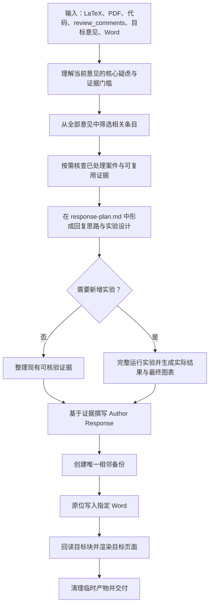

<div align="center">

# IEEE Transactions Review Response Engineer

### 从单条审稿意见出发，构建可复现、可核验、可直接提交的完整证据链

[](./SKILL.md)
[](https://www.ieee.org/)
[](./references/experiment-and-evidence-protocol.md)
[](./SKILL.md)

**一次处理一条意见 · 联合核对论文与代码 · 完整执行必要实验 · 原位更新 response Word**

</div>

---

## 项目简介

`IEEE Transactions Review Response Engineer` 是一个面向学术论文返修场景的 Codex Skill。它不仅撰写回复文字，还会结合论文 LaTeX、最终 PDF、实现代码、完整审稿意见、既往处理记录和实际实验结果，判断审稿人的核心疑虑，设计足够且不冗余的验证，并将证据直接写入用户指定的 response Word。

它适用于：

- IEEE Transactions 论文返修与 rebuttal；
- 需要补充训练、消融、敏感性或统计分析的审稿意见；
- 论文描述与代码实现的一致性核查；
- 基于 Word 模板撰写 `Author Response`；
- 需要 IEEE 风格图表和可复现实验记录的回复任务。

## 核心能力

- **单条意见聚焦**：每次只处理一条意见，围绕审稿人的真实疑虑建立证据链。
- **论文—代码联合理解**：核对研究动机、方法设计、实验设置、结论边界及对应实现。
- **关联意见筛选**：先阅读完整 `review_comments`，再按需检查相关的已处理案件和可复用证据。
- **实验完整执行**：不缩减数据、epoch、模型规模、基线、搜索空间、重复次数或随机种子。
- **结果可追溯**：每个数值都绑定机器可读结果、字段位置、生成代码和运行配置。
- **IEEE 图表规范**：使用 Times New Roman，保证最终栏宽下可读，并规范标注多子图编号。
- **Word 原位交付**：备份后只修改目标 `Author Response`，保留模板其余内容和格式。

## 工作流



## 输入

处理一条意见时，建议提供：

| 输入 | 用途 |
|---|---|
| 论文 LaTeX 源文件 | 定位方法、公式、实验设置和待修改表述 |
| 论文最终 PDF | 核对最终排版、图表、编号和实际呈现内容 |
| 实现代码 | 理解数据、模型、训练、评估和配置逻辑 |
| 完整 `review_comments` | 在所有审稿意见中筛选与当前意见相关的条目 |
| 当前意见及稳定编号 | 例如 `R2-C4`，用于案件和 Word 精确定位 |
| 既往案件目录 | 仅在相关意见已经处理时复用可核验证据 |
| response Word | 作为最终 Author Response 的原位交付文件 |

## 核心产物

```text
R2-C4/
├── response-plan.md
└── experiment/                 # 仅在需要新增实验或分析时创建
    ├── run_*.py
    ├── config.*                # 原框架或复现确实需要时保留
    ├── results.json/csv        # 机器可读的实际结果
    ├── table.*                 # 最终回复使用的表格
    └── figure.pdf/png          # 最终回复使用的图

response_to_reviewers.docx
response_to_reviewers.before-R2-C4.docx
```

`response-plan.md` 集中记录：

1. 原始意见；
2. 核心疑虑、真实意图与证据门槛；
3. 相关论文位置、代码文件、配置和现有结果；
4. 关联意见、处理状态与逐项复用判定；
5. 回复思路和完整实验设计；
6. 实际结果、来源字段和结论边界；
7. Word 目标块、备份路径和验证结论。

## 关联意见与证据复用

Skill 使用由宽到窄的检索方式控制工作量：

1. 完整读取一次 `review_comments`；
2. 根据疑虑、主张、方法模块、数据集、指标和证据需求筛选相关意见；
3. 未处理的相关意见只记录关联和潜在共用点；
4. 已处理的相关意见先只读取对应 `response-plan.md`；
5. 只有准备复用某项证据时，才读取方案明确引用的结果、配置和代码文件；
6. 复用前逐项核对数据划分、代码 revision、训练预算、checkpoint、基线、指标、种子和统计单位。

任何关键条件不一致时，既有结果只作为背景；当前意见要求的新控制变量、数据、基线、指标和分析仍需完整执行。

## 实验与证据标准

- 使用原论文或官方实现的完整数据、模型和训练预算；
- 为各方法提供一致的数据、预处理、评价实现和公平调参范围；
- 预先写明实验变量、随机种子、指标和结论判定规则；
- 保留全部计划运行，不挑选有利结果；
- 报告样本量、效应量、置信区间和适用的统计检验；
- 负面或混合结果必须如实呈现，并相应收缩论文主张；
- 只生成最终证据链真正使用的表格和图片。

详细规则见 [精简实验与证据协议](./references/experiment-and-evidence-protocol.md)。

## Author Response 与 Word 交付

回复第一句直接给出核心结论，随后连接实验目的、实际结果、统计不确定性和结论边界。公式使用 `$...$` 表达，表格和图片只保留当前论证需要的信息。

Word 更新遵循以下规则：

- 最终内容直接写入用户指定的 response Word；
- 修改前创建唯一相邻备份：`<word-stem>.before-<comment-id>.docx`；
- 只修改当前意见的 `Author Response`；
- 保留 `Original Comment`、`Changes in Manuscript`、其他意见和模板格式；
- 写回后重新读取目标回复块，核对正文、表格、图片、数字、符号和定位锚点；
- 只渲染目标回复实际占用的页面；出现分页或布局异常时再扩大到相邻页；
- staging、渲染页、临时 PDF 和运行日志在成功后清理。

详细规则见 [回复、图表与 Word 原位更新协议](./references/response-and-artifact-protocol.md)。

## 安装

### Windows PowerShell

```powershell
git clone https://github.com/whiteMo0623/ieee-transactions-review-response-engineer.git `
  "$env:USERPROFILE\.codex\skills\ieee-transactions-review-response-engineer"
```

### macOS / Linux

```bash
git clone https://github.com/whiteMo0623/ieee-transactions-review-response-engineer.git \
  "${CODEX_HOME:-$HOME/.codex}/skills/ieee-transactions-review-response-engineer"
```

调用名称：

```text
$ieee-transactions-review-response-engineer
```

## 使用示例

```text
$ieee-transactions-review-response-engineer

请处理 Reviewer 2 的 Comment 4。论文 LaTeX、最终 PDF、实现代码、完整
review_comments、既往案件目录和 response_to_reviewers.docx 已放在项目中。
请完整执行必要实验，并将 Author Response 直接写入指定 Word；案件目录只保留
response-plan.md，以及必要的实验代码、实际结果和最终图表。
```

## 初始化案件

```bash
python scripts/init_review_case.py R2-C4 \
  --root response_exp \
  --paper-tex path/to/main.tex \
  --paper-pdf path/to/paper.pdf \
  --code-root path/to/repository \
  --review-comments path/to/review_comments.docx \
  --comment-file path/to/comment.md \
  --word-file path/to/response_to_reviewers.docx \
  --previous-cases path/to/response_exp
```

初始化脚本仅创建当前意见的 `response-plan.md` 骨架并记录输入路径与可用的 Git revision。

## 验收

完成当前意见后运行：

```bash
python scripts/audit_review_case.py path/to/R2-C4
```

审计内容包括：

- `response-plan.md` 结构完整且无占位符；
- `experiment_required` 已明确为 `true` 或 `false`；
- 需要实验时，存在运行代码和机器可读结果；
- 案件目录符合核心产物约束；
- 指定 Word 和唯一相邻备份均存在，且目标回复已写入。

## 仓库结构

```text
.
├── README.md
├── SKILL.md
├── agents/
│   └── openai.yaml
├── references/
│   ├── experiment-and-evidence-protocol.md
│   └── response-and-artifact-protocol.md
└── scripts/
    ├── init_review_case.py
    └── audit_review_case.py
```

---

<div align="center">

**让每一条 Author Response 都由真实、完整、可复现的证据支撑。**

</div>
