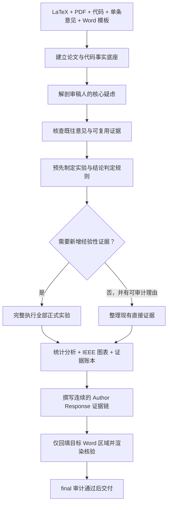

<div align="center">

# IEEE Transactions Review Response Engineer

### 把一条审稿意见，变成一条可复现、可核验、可直接提交的证据链

[](./SKILL.md)
[](https://www.ieee.org/)
[](https://www.python.org/)
[](./references/experiment-and-evidence-protocol.md)

**一次只处理一条意见 · 先完成实验再写回复 · 所有数值来自真实结果 · 默认只回填 `Author Response`**

</div>

---

## 这不是一个“润色回复”工具

`IEEE Transactions Review Response Engineer` 是一个面向严肃论文返修工作的 Codex Skill。它联合阅读论文 LaTeX、最终 PDF、实现代码、既往回复和 Word 模板，识别审稿人的真实疑虑，设计并完整执行必要实验，再把真实结果组织成连续、可追溯的 `Author Response`。

它解决的不是“如何把回复写得更好听”，而是更关键的问题：

> **什么证据足以消除这条疑虑？这些证据是否真实完成、公平比较、可复现，并且没有超出结果支持的结论边界？**

## 核心能力

| 能力 | 作用 |
|---|---|
| 论文双版本理解 | 同时核对 LaTeX 源文件与 PDF 最终呈现，覆盖方法、公式、实验和结论边界 |
| 论文—代码映射 | 追踪数据流、模型、损失、训练、评估、配置与论文叙述之间的对应关系 |
| 单条意见解剖 | 区分显式问题、隐含质疑、证据门槛与审稿人期待的动作 |
| 既往证据复用审计 | 仅复用条件完全匹配且来源可追溯的实验，拒绝用“相似结果”规避必要工作 |
| 完整补充实验 | 固化数据、预算、基线、随机种子、统计方法和结论判定规则，禁止缩水运行 |
| IEEE 风格图表 | Times New Roman、最终栏宽可读、灰度可辨、多子图编号、矢量格式输出 |
| 证据账本 | 将回复中的主张和数值绑定到原始结果、字段、脚本、配置与运行 ID |
| Word 安全回填 | 默认只修改当前意见的 `Author Response`，保留其他内容与原有格式 |
| 分阶段审计 | 在计划、结果和最终交付阶段阻止占位符、缺失运行和断裂证据链通过 |

## 工作流



## 不偷懒原则

当某条意见需要实验时，本 Skill 明确禁止通过以下方式节省时间：

- 缩减数据集或改用更容易的数据划分；
- 减少 epoch、模型规模、训练预算或搜索空间；
- 省略强基线、控制组或审稿人点名的方法；
- 减少预先规定的随机种子和重复次数；
- 只选择成功、显著或有利的运行；
- 用冒烟测试、估算值或预期结果冒充正式证据；
- 在结果不支持原主张时，用措辞掩盖或夸大结论。

实验耗时不是降低证据标准的理由。若必要实验尚未完成，Skill 会报告当前状态或阻塞，而不是生成貌似完整的回复。

## 安装

### Windows PowerShell

```powershell
git clone https://github.com/whiteMo0623/ieee-transactions-review-response-engineer.git `
  "$env:USERPROFILE\.codex\skills\ieee-transactions-review-response-engineer"
```

### macOS / Linux

```bash
git clone https://github.com/whiteMo0623/ieee-transactions-review-response-engineer.git \
  "${CODEX_HOME:-$HOME/.codex}/skills/ieee-transactions-review-response-engineer"
```

安装后重新打开 Codex 会话，使用以下名称调用：

```text
$ieee-transactions-review-response-engineer
```

## 快速开始

向 Codex 提供以下材料：

1. 论文 LaTeX 主文件及全部依赖；
2. 论文最终 PDF；
3. 对应实现代码与正式配置；
4. 当前需要处理的一条原始审稿意见；
5. 已处理意见的案件目录（如有）；
6. response Word 模板（如需回填）。

示例请求：

```text
$ieee-transactions-review-response-engineer

请处理 Reviewer 2 的 Comment 3。论文 LaTeX、PDF、实现代码、此前案件和
response.docx 已放在项目目录中。请先提交对该意见的理解与完整实验方案，
然后执行全部必要实验，基于真实结果撰写 Author Response，并仅回填模板中
这一条意见对应的 Author Response。
```

## 建立独立案件

Skill 内置案件初始化脚本，用于记录输入路径、文件哈希、Git 提交状态以及可复现目录结构：

```bash
python scripts/init_review_case.py reviewer-2-comment-3 \
  --root review_response_cases \
  --paper-tex path/to/main.tex \
  --paper-pdf path/to/paper.pdf \
  --code-root path/to/repository \
  --comment-file path/to/comment.md \
  --word-template path/to/response.docx \
  --previous-cases path/to/prior_cases
```

`--word-template` 与 `--previous-cases` 在确实不存在时可以省略。论文、代码和当前意见不可省略。

生成的案件目录如下：

```text
review_response_cases/reviewer-2-comment-3/
├── case.json
├── inputs/
│   └── original-comment.md
├── notes/
│   ├── paper-understanding.md
│   └── code-paper-map.md
├── analysis-and-experiment-plan.md
├── experiments/
│   ├── manifest.json
│   ├── src/
│   ├── configs/
│   ├── logs/
│   ├── raw/
│   ├── processed/
│   └── figures/
├── response/
│   ├── author-response.md
│   ├── manuscript-changes.md
│   └── evidence-ledger.json
└── delivery/
```

## 三阶段审计

```bash
# 检查论文/代码理解、意见分析和实验方案
python scripts/audit_review_case.py --stage plan path/to/case

# 检查预定运行、随机种子、配置、日志和原始结果
python scripts/audit_review_case.py --stage results path/to/case

# 检查最终回复、证据账本和全部交付物
python scripts/audit_review_case.py --stage final path/to/case

# 同时要求存在填好的 DOCX 和渲染预览
python scripts/audit_review_case.py --stage final --require-docx path/to/case
```

只有审计输出 `AUDIT PASSED`，案件才满足结构与溯源完整性要求。审计不能替代学术判断，但能阻止常见的缺失运行、断裂引用和未完成占位符进入最终回复。

## Word 模板处理边界

除非用户另有说明，Skill 只填写当前意见对应的 `Author Response`：

- 保留 `Original Comment` 原文；
- 保留 `Changes in Manuscript` 原有内容；
- 保留其他审稿意见与回复；
- 保留段落样式、编号、页眉页脚、批注和修订状态；
- 永不覆盖用户提供的原始模板；
- 完成后渲染全部页面，检查非目标区域是否发生变化。

若目标区域无法唯一定位，Skill 会停止写入并请求明确位置，不会依赖模糊匹配冒险修改错误段落。

## 回复风格

最终 `Author Response` 遵循以下原则：

- 第一段直接给核心结论，不以客套开场；
- 用文字、公式、表格和必要图片形成连续证据链；
- 所有公式使用 `$...$` 形式的 LaTeX；
- 所有数值均绑定实际完成的运行结果；
- 明确报告样本量、不确定性、统计单位和结论边界；
- 负面或混合结果必须如实呈现，并相应收缩论文主张；
- 避免超过证据支持范围的“显著”“鲁棒”“泛化”等表述。

## 仓库结构

```text
.
├── SKILL.md
├── agents/
│   └── openai.yaml
├── references/
│   ├── experiment-and-evidence-protocol.md
│   └── response-and-artifact-protocol.md
└── scripts/
    ├── init_review_case.py
    └── audit_review_case.py
```

- [`SKILL.md`](./SKILL.md)：核心工作流与不可绕过的执行门槛。
- [`experiment-and-evidence-protocol.md`](./references/experiment-and-evidence-protocol.md)：实验公平性、完整性、统计与证据追溯协议。
- [`response-and-artifact-protocol.md`](./references/response-and-artifact-protocol.md)：回复写作、IEEE 图表和 Word 交付规范。
- [`init_review_case.py`](./scripts/init_review_case.py)：初始化单条意见案件。
- [`audit_review_case.py`](./scripts/audit_review_case.py)：执行分阶段完整性审计。

## 适用范围

适用于需要联合论文、代码和实验处理审稿意见的 IEEE Transactions 返修工作，也可用于其他强调实验严谨性、统计证据和 Word response 模板的期刊。

它不会替代作者对论文贡献、学术诚信和最终措辞的责任；它提供的是一套让每个结论都能回到真实证据的工程化工作流。

---

<div align="center">

**一条意见，一个独立案件；一个结论，一条可追溯证据。**

</div>
